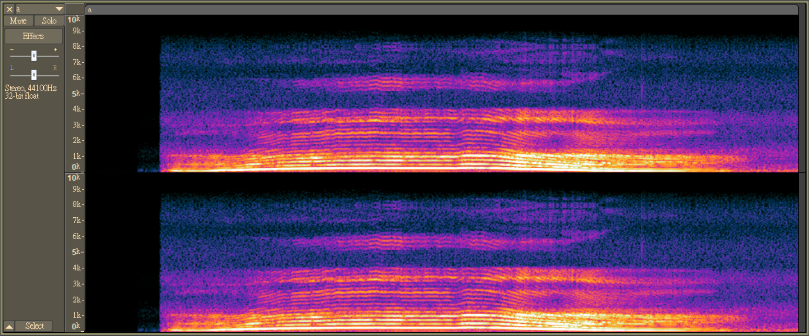
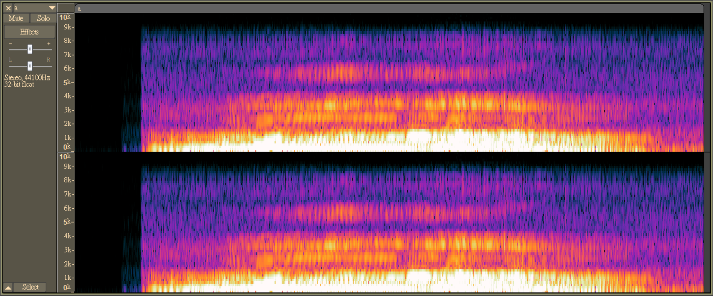

# Homework 1: Speech Signal Processing Toolkits

Student: Shien-Ting Huang (311511063), National Yang Ming Chiao Tung University

## Introduction

In this homework, we played with a useful audio processing toolkit which contain *Audacity* and *Sound eXchange (SoX)*.

### Audacity

Website: https://www.audacityteam.org/

### Sound eXchange (SoX)

Website: http://sox.sourceforge.net/ or https://sourceforge.net/projects/sox/

## Tasks

- [x] Record an audio (stereo, 44.1 kHz)
- [x] View the spectrogram
- [ ] Effect > Normalization
- [x] Mix (stereo to mono)
- [ ] Resample from 44.1 kHz to 16 kHz
- [ ] Rubberband

### Recording

Sound Setting of recording are 2 channels (stereo), and of quality sample rate is set to 44.1 kHz and sample format 32-bit float.

A 5-second audio is recorded and saved as `a.wav`.

### Spectrogram view

I write a simple Python program `audacity_info.py` to help list the supported window sizes (in samples) and the corresponding windows lengths (in milliseconds). Then, for the narrow-band and the wide-band spectrograms, I respectively choose 1024 and 128 as the window sizes.

Table. The window sizes and the corresponding window lengths of narrow- and wide- spectrograms.

|             | Window size (samples) | Approx. window length (ms) |
|-------------|----------------------:|---------------------------:|
| Narrow-band |                  1024 |                         20 |
| Wide-band   |                   128 |                          3 |

Figure. Narrow-band spectrogram with a window size of 1024.

Figure. Narrow-band spectrogram with a window size of 128.

### Normalization

### Mixing (stereo to mono)

The command `sox a.wav mono.wav remix -` mixes all channels to mono.

### Resampling

### Rubberband
